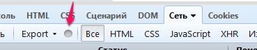
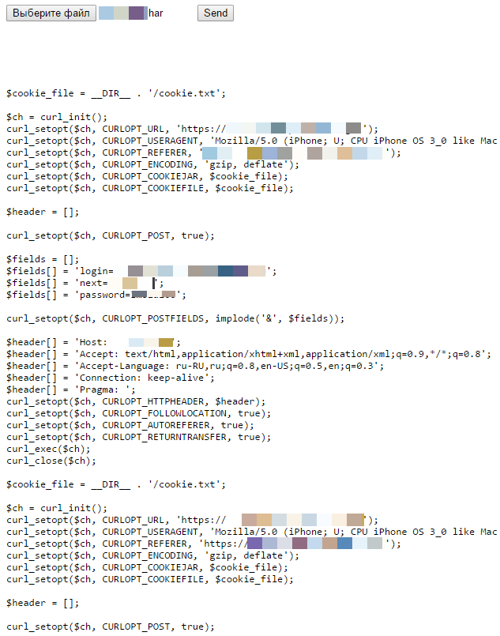

#Конвертер HAR в cURL для PHP
How to http://habrahabr.ru/post/84683/

Код для автоматической генерации PHP кода для инициализации HTTP запросов через cURL

##Область применения:

- Аутентификация на сайте
- Фильтрация данных
- Просмотр цепочки редиректов

##Для получения HAR файла нам понадобится:

- [Mozilla FireFox](https://www.mozilla.org/ru/firefox/new/)
- [FireBug](http://getfirebug.com/)
- [netExport](http://getfirebug.com/releases/netexport/)

##Как генерировать:

Отрываем целевой сайт, запускаем firebug, во вкладке "Сеть" появится кнопка .
Нажмем ее и она загорится зеленым цветом. Введем необходимые данные для аутентификации и отправим форму.
Далее следуме по ссылкам до целевой страницы. После того как мы добрались до цели нужно экспортировать
собранную информацию. Нажимаем "Export" и выбираем "Save as..." сохранив файлик открываем index.php. 
В форме загрузки файла добавляем наш файл !*.har. Жмем Send и получаем нужный порядок действий. 

##Результат:

##Совет:

Естественно для того чтоб мусора было меньше(лишние запросы) перед генерацией лучше отключить 
отображение изображений в браузере.

